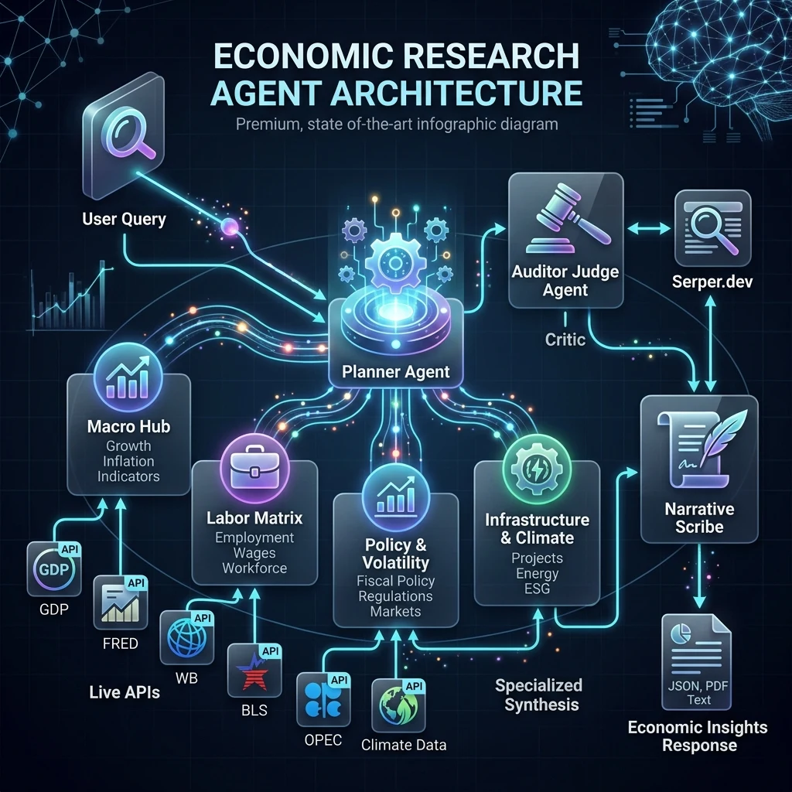
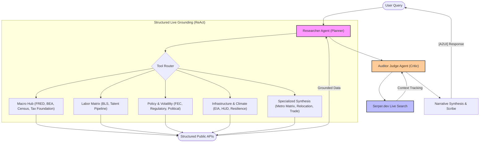

# Economic Research Agent (ERA)

[](https://github.com/google/adk)
[](#)
[](#)

The **Economic Research Agent (ERA)** is an enterprise-grade AI Reasoning Engine built on the Vertex AI Agent Development Kit (ADK). It automates regional economic analysis, labor market data extraction, and commercial real estate cost modeling by orchestrating live APIs (FRED, BLS, CENSUS, HUD, EIA) in tandem with dynamic Serper.dev Internet Extractors.

---

## A. Capabilities & Architecture

The ERA executes multi-source data extraction to underwrite regional economics. It utilizes an Auditor-Critic loop via Google Search to cross-verify quantitative datasets and eliminate reliance on static mock data.

### Technical Details

| Feature | Specification |
| :--- | :--- |
| **Architecture** | ReAct Multi-Point Orchestration (Single-Agent Class) |
| **Framework** | Google Vertex AI ADK |
| **Vertical** | Economic Development / Real Estate Underwriting |
| **Grounding APIs** | FRED, BLS, Census, HUD, EIA, RentCast, Serper.dev |

### Verification Test Suite Matrix

| Data Source | Evaluator Query Payload | Derived Output / Metric |
| :--- | :--- | :--- |
| **FRED** | "What is the 10-year unemployment trend for Austin vs. Nashville?" | MSA Unemployment Time-Series |
| **BEA** | "Compare the Real GDP growth rate for the San Francisco MSA vs. Dallas." | Real GDP Growth Rate |
| **Census** | "Show the educational attainment (Bachelor's+) pipeline for Seattle vs. Raleigh." | Regional Educational Attainment |
| **HUD** | "Is Austin affordable for a 50% AMI workforce? Correlate rent vs income." | HUD Area Median Income (AMI) / FMR |
| **BLS** | "What is the 10-year wage trend vs. unionization in the Rust Belt?" | OES Occupational Wage Averages |
| **FEC** | "Benchmark the political stability of site selection in Ohio using FEC data." | Campaign Finance Data Metrics |
| **USITC** | "Analyze Arizona as a semiconductor hub. Show trade flows vs state tax rates." | International Trade Harmonized Data |
| **EIA** | "Compare industrial electricity rates in Texas vs. Ohio for a data center." | Industrial/Commercial Utility Rates (kWh) |
| **Register** | "Are there any recent regulatory notices regarding semiconductors in Texas?" | Federal Register Compliance Data |
| **Tax Foundation** | "What are the corporate income tax brackets for North Carolina in 2024?" | State-level Corporate Tax Brackets |
| **Workforce** | "Analyze the workforce AI exposure and automation potential for Developers." | O*NET Task Automation Hierarchies |
| **MLS Sourcing** | "Find multifamily investment properties in Columbus, OH and estimate their Cap Rates." | Active MLS Property Listings (RentCast) |
| **USPS** | "Find the county FIPS code for ZIP code 78702 using USPS crosswalk." | ZIP-to-FIPS Geocoding |
| **CHAS** | "What is the percentage of cost-burdened households in Travis County, TX?" | CHAS Housing Burden Coefficients |
| **Labor Shifts** | "Compare Austin and Columbus for AI-driven labor market disruption." | Projected Labor Disruption Metrics |
| **Site Selection** | "Create a Metro Matrix comparing Denver and Seattle for a new Tech Hub." | Side-by-Side Normalized Metro Matrix |

### Universal Whitepaper Generator
The agent includes a `UniversalWhitepaperOrchestrator` to synthesize raw API extraction payloads into formatted Markdown and HTML reports. It can be invoked via Python:

```bash
uv run python -c "from economic_research.agent import ERAAgent; print(ERAAgent().generate_whitepaper('YOUR_QUERY_HERE'))"
```

| Strategic Pillar | Validated Query Payload | Output Document |
| :--- | :--- | :--- |
| **Pillar B** (Real Estate) | "Underwrite a Multi-Family Investment portfolio across the Sun Belt, contrasting Phoenix, AZ, Atlanta, GA, and Raleigh, NC." | Real Estate Underwriting Brief |
| **Pillar A + C** (Workforce AI) | "Select the optimal regional Hub for an Advanced AI R&D Center, contrasting Columbus, OH, Pittsburgh, PA, and Salt Lake City, UT." | R&D Site Selection Brief |
| **Pillar A + D** (Global Trade) | "Underwrite a Tier-1 Semiconductor Manufacturing Facility site selection, contrasting Phoenix, AZ and Syracuse, NY." | Trade & Regulatory Compliance Brief |

### Grounding & Analysis Modules

#### Labor & Macroeconomic Data
- **Wage Distribution Analysis**: Extracts occupational wage coefficients via the live BLS and FRED endpoints.
- **Unemployment Trajectories**: Provides 10-year historical MSA-level time-series sampling.

#### Real Estate & Utilities
- **Industrial Electricity Metrics**: Utilizes the EIA v2 Open Data API to harvest commercial utility costs (per kWh).
- **Commercial Lease Rates**: Dispatches Serper Internet Extractors to parse live CoStar and regional real estate indices.
- **MLS Multi-Family Underwriting**: Correlates active real estate listings (RentCast API) with HUD Section 8 Fair Market Rents.

#### Automation & Task Disruption Analysis
- **AI Task Exposure Matrix**: Maps O*NET job classifications against regional labor pools to project reskilling demand.
- **Climate Resilience Indexing**: Integrates live FEMA National Risk Index endpoints for Heat, Flood, and Hurricane risks.
- **Logistics Intermodal Metrics**: Extracts DOT Bureau of Transportation Statistics (BTS) indices for logistics planning.

#### Fiscal & Regulatory Policy
- **Tax Abatement Tracking**: Parses Good Jobs First data to discover regional Chapter 313 and JDIG tax abatements.
- **Regulatory Compliance Drift**: Tracks live Federal Register notices and FEC political risk distributions.

---

## B. Architecture Visuals





---

## C. Setup & Execution

### API Configuration (.env)

The ERA uses a modular grounding strategy. Set these in your `.env` file (see `.env.example`).

| Service | Category | Status | Signup Link |
| :--- | :--- | :--- | :--- |
| **FRED** | Macro & Labor | **Required** | [Sign up for FRED API](https://fredaccount.stlouisfed.org/login/secure/apikeys) |
| **BEA** | GDP & Income | **Required** | [Sign up for BEA API](https://apps.bea.gov/api/signup/index.cfm) |
| **BLS** | Labor Stats | **Required** | [Sign up for BLS API](https://data.bls.gov/registrationEngine/) |
| **Census** | Demographics | **Required** | [Sign up for Census API](https://api.census.gov/data/key_signup.html) |
| **HUD** | Affordability | **Required** | [Sign up for HUD API](https://www.huduser.gov/portal/dataset/fmr-api.html) |
| **FEC** | Political Risk | **Required** | [Sign up for FEC API](https://api.open.fec.gov/) |
| **EIA** | Energy & Power | **Optional** | [Sign up for EIA API](https://www.eia.gov/opendata/register.php) |
| **NewsAPI** | Sentiment | **Optional** | [Sign up for NewsAPI](https://newsapi.org/register) |
| **Serper** | Live Judge Search | **Optional** | [Sign up for Serper.dev](https://serper.dev/) |
| **CDC** | Healthcare Stats | **Optional** | [Sign up for CDC Data](https://data.cdc.gov/) |
| **RentCast** | Real Estate Listings | **Optional** | [Sign up for RentCast API](https://www.rentcast.io/api) |
| **O*NET** | AI Task Exposure | **Optional** | [Sign up for O*NET Web Services](https://services.onetcenter.org/) |

### Installation
ERA uses `uv` for dependency management.

```bash
# Create and synchronize the virtual environment
uv sync --dev
```

### Google Cloud Setup (Prerequisites)

Before deploying to the Vertex AI Reasoning Engine, ensure your local environment is authenticated with Google Cloud:

1. **Install the Google Cloud CLI**: Follow the [installation guide](https://cloud.google.com/sdk/docs/install).
2. **Set your active project**:
   ```bash
   gcloud config set project YOUR_PROJECT_ID
   ```
3. **Authenticate your credentials**:
   ```bash
   gcloud auth application-default login
   ```

### Using Google Agents CLI
This agent is deployed and managed via the **Google Agents CLI** (`agents-cli`). 

**Install the CLI**:

```bash
uv tool install google-agents-cli
```

### Running the Agent

```bash
# Option 1: Web-based Playground
agents-cli playground

# Option 2: CLI-Based Execution
make run

# Option 3: MCP Server Target (For IDE integration)
make mcp
```

---

## D. Customization & Extension

- **System Persona**: Modify `economic_research/prompt.py` to alter agent response constraints.
- **Tool / Skill Integration**: Add new tools to `economic_research/tools/` and register them in `economic_research/agent.py`.
- **Normalization Utilities**: Utilize `shared_libraries/helper.py` to introduce HTTP/JSON parsing logic.

---

## E. Evaluation & Testing

- **Golden Suite**: Executes a 21-question integration suite (`tests/integration/`) against baseline regional scenarios.
- **Grounding Validation**: The `eval/run_eval.py` script leverages Gemini to score Grounding Coverage across public APIs.
- **Regression Testing**: Supports unit and integration testing via pytest.

```bash
# Execute integration test suite
uv run pytest tests/integration/test_full_golden_suite.py

# Execute unit and harvester tests
uv run pytest tests/unit/
```

---

## F. Deployment

### Vertex AI Agent Runtime
The ERA is deployed to Google Cloud via the Vertex AI Reasoning Engine:

```bash
agents-cli deploy
```

Use `agents-cli deploy --list` and `agents-cli deploy --status` to monitor deployed instances.

### Security Configurations
- **In-Memory Processing**: The agent processes data in-memory without persistent local storage or static cache tables.
- **Audit Bypass Flag**: Set `ERA_BYPASS_SUPERVISOR=true` in `.env` to bypass Auditor Critic loops for CI/CD pipelines.
