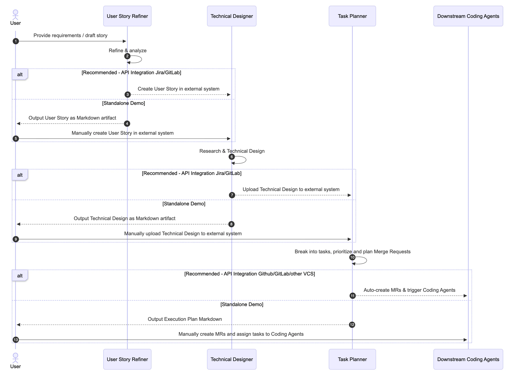

# SDLC Workflow Suite

## Overview & Architecture

The **SDLC Workflow Suite** is an automated multi-agent pipeline designed to streamline the Software Development Life Cycle (SDLC). Built with Google ADK's `SequentialAgent`, this recipe chains three specialized agents into an end-to-end workflow:

1. **User Story Refiner (`user_story_refiner`)**: Analyzes raw feature requests or draft stories and refines them into standardized Agile work items complete with INVEST principles, business context, and BDD-style (Given/When/Then) Acceptance Criteria.
2. **Technical Designer (`technical_designer`)**: Evaluates the refined user story against codebase architecture (optionally querying a Spanner Code Knowledge Graph) to generate an RFC Technical Design document, Mermaid architecture diagram, and Architecture Decision Records (ADRs).
3. **Task Planner (`task_planner`)**: Translates the technical design into granular, testable development tasks and Pull Request merge chains formatted in a comprehensive execution table.



### SequentialAgent Pipeline

The root agent (`sdlc_workflow_suite`) is defined as a `SequentialAgent`:

```python
root_agent = SequentialAgent(
    name="sdlc_workflow_suite",
    description="End-to-end SDLC workflow suite.",
    sub_agents=[
        user_story_refiner_agent,
        technical_designer_agent,
        task_planner_agent,
    ],
)
```

Each stage operates on the accumulated conversation context, producing structured artifacts from initial requirement to deployment-ready merge requests.

## Setup & Prerequisites

### Prerequisites

* Python 3.11+
* [uv](https://docs.astral.sh/uv/) for fast Python package management

```bash
curl -LsSf https://astral.sh/uv/install.sh | sh
```

### Environment Configuration

Configure environment variables by copying `.env.example`:

```bash
cp .env.example .env
```

Populate `.env` with your Google Cloud project settings and model name:

```env
MODEL_NAME=gemini-3.5-flash
GOOGLE_CLOUD_PROJECT=your-gcp-project-id
GOOGLE_CLOUD_LOCATION=us-central1
GOOGLE_CLOUD_STORAGE_BUCKET=your-bucket-name
```

*(Optional)* If you connect to an existing Cloud Spanner Code Knowledge Graph, set `SPANNER_PROJECT_ID`, `SPANNER_INSTANCE_ID`, and `SPANNER_DATABASE_ID`. When omitted, the suite operates in offline standalone mode.

### Installation

Install dependencies using `uv`:

```bash
uv sync --dev
```

## How to Run

### Running Locally with ADK Web UI

To launch the interactive ADK web interface:

```bash
uv run adk web sdlc_workflow_suite
```

### Running Tests

Execute the unit test suite:

```bash
uv run pytest --ignore=tests/integration
```

To run end-to-end integration tests (requires GCP credentials):

```bash
uv run pytest tests/integration
```

### Deploying to Vertex AI Agent Engine

You can deploy the agent suite to Google Cloud Vertex AI Reasoning Engine using the included deployment script:

```bash
uv run deployment/deploy.py --create
```
