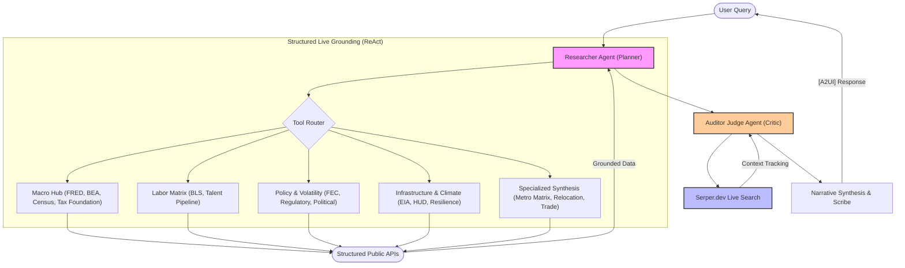

# 🧠 Evolved Economic Research Agent (ERA)

[](https://github.com/google/agents-cli)
[](https://github.com/google/adk)
[](#)
[](#)

An enterprise-grade, **Autonomous Economic Intelligence** engine for high-fidelity regional economic analysis, labor market evaluation, and cross-industry site selection. Upgraded to **Agent Runtime (ADK 2.0 / AdkApp)** with a 100% Live-API grounded architecture utilizing dynamic **Serper.dev Internet Extraction Engines** to provide infinite geographic coverage and zero mock-data dependencies.

---

## A. Overview & Functionalities

The **Economic Research Agent (ERA)** is a production-grade site-selection and market intelligence consultant. Designed for corporate research, ERA automates comparative metropolitan cost-modeling by orchestrating live public APIs (FRED, BLS, CENSUS, HUD, EIA) into McKinsey-style strategic briefs—now upgraded with an automated **Auditor Judge Agent** (via Serper Live Search) for zero-hallucination verification.

> [!NOTE]
> While organizations like Anthropic maintain dedicated, proprietary economic research teams and blogs focused on modeling AI usage and its macroeconomic impact, the **Economic Research Agent (ERA)** on Agent Garden serves a different purpose. Rather than striving to publish proprietary articles or centralized think-tank insights, our goal is to provide a fully transparent, open-source framework. This enables diverse industries and independent research analysts covering real estate, regional development, labor structures, and utility planning to dynamically spin up customized, live-grounded market intelligence pipelines tailored to their own analytical needs.

### 📊 Agent Details

| Feature | Specifics |
| :--- | :--- |
| **Interaction Type** | Conversational / Strategic Consultant |
| **Complexity** | Advanced (Multi-Source Synthesis) |
| **Agent Type** | Single Agent (ADK Class-Based) |
| **Vertical** | Economic Development / Real Estate / Finance |
| **Grounding** | 100% Live-API (FRED, BLS, HUD, Census, BEA) |

### 💬 Example Interaction (Strategic Consulting)

**User**: "Compare Austin and Raleigh for a new data center HQ."

**ERA**: "I am analyzing technical and fiscal ROI for NAICS 518210 (Data Processing). 
1. **Utility Benchmarking**: Texas (ERCOT) industrial rates average 8.2c/kWh, while North Carolina (Duke Energy) is 7.5c/kWh.
2. **Talent Pipeline**: UT Austin graduated 1,200 CS majors in 2023 vs. 850 from NC State.
3. **Fiscal Climate**: NC has a scheduled corporate tax phasedown to 0% by 2030, offering a better longitudinal OPEX profile.
*Recommendation: Raleigh for long-term tax stability; Austin for immediate talent density.*"

### 💎 Consultant's Playbook: The "WOW" Matrix

| Source | Strategic "WOW" Query | Consultative Insight |
| :--- | :--- | :--- |
| **FRED** | "What is the 10-year unemployment trend for Austin vs. Nashville?" | Longitudinal Labor Resilience |
| **BEA** | "Compare the Real GDP growth rate for the San Francisco MSA vs. Dallas." | Macroeconomic Momentum |
| **Census** | "Show the educational attainment (Bachelor's+) pipeline for Seattle vs. Raleigh." | Talent Depth & Engineering Density |
| **HUD** | "Is Austin affordable for a 50% AMI workforce? Correlate rent vs income." | Workforce Retention & COLA Risk |
| **BLS** | "What is the 10-year wage trend vs. unionization in the Rust Belt?" | Labor Cost & Structural Risk |
| **FEC** | "Benchmark the political stability of site selection in Ohio using FEC data." | Political Volatility & Lobbying Exposure |
| **USITC** | "Analyze Arizona as a semiconductor hub. Show trade flows vs state tax rates." | Supply Chain Dependency (Chips) |
| **EIA** | "Compare industrial electricity rates in Texas vs. Ohio for a data center." | Operational Utility Benchmarking |
| **Register** | "Are there any recent regulatory notices regarding semiconductors in Texas?" | Live Regulatory Drift & Compliance |
| **Tax F.** | "What are the corporate income tax brackets for North Carolina in 2024?" | Fiscal Competitiveness |
| **Workforce** | "Analyze the workforce AI exposure and automation potential for Customer Service Representatives vs. Software Developers." | AI Workforce Adaptation Strategy |
| **MLS Sourcing** | "Find multifamily investment properties in Columbus, OH and estimate their Cap Rates using HUD rents." | Real Estate Sourcing & Yield Yields |
| **USPS Cross.** | "Find the county FIPS code for ZIP code 78702 using USPS crosswalk." | Dynamic ZIP-to-FIPS Lookup |
| **CHAS** | "What is the percentage of cost-burdened households in Travis County, TX (FIPS 48453) using CHAS data?" | Regional Housing Problems & Supply Burden |
| **Labor Shifts** | "Compare Austin and Columbus for AI-driven labor market disruption and forecast their 3-year displacement outlook." | Labor Market Disruption Forecasting |
| **Combined** | "Create a Metro Matrix comparing Denver and Seattle for a new Tech Hub." | 360-Degree Site Selection (Level 3) |


### 📡 Consultative Capabilities

#### 💼 Labor & Macro (FRED/BLS)
- **Live Wage Analysis**: Real-time median hourly wages fetched via live FRED search (No hardcoded mocks).
- **Unemployment Trends**: 10-year historical time-series sampling for MSA-level analysis.
- **Union Density**: Live state-level union membership percentages.

#### 🏢 Real Estate & Utilities (CoStar/RentCast/EIA)
- **Energy Matrix**: Live Industrial electricity rates (per kWh) and regional renewable energy shares using the compliant **EIA v2 Open Data API**.
- **Commercial ROI Modeling**: Dynamic Serper Harvesters extract live, city-level **CoStar, Zillow, and Redfin PSF average lease rates** and vacancy rates on the fly for any candidate market.
- **MLS Sourcing & Underwriting**: Fetches active property listings from the **RentCast API** and correlates them with local HUD FMR rents.
- **Acquisitions Deal Underwriting & Pro-Formas**: Modeled via our graduated `RealEstatePortfolioAdvisor`, generating complete amortization, NOI, DSCR, and Debt Yield brief tables.

#### 🤖 AI Labor Exposure & Task Forecasting (New!)
- **AI Task Exposure & Automation Risk**: Maps O*NET task hierarchies against BLS occupational codes to quantify displacement vs. augmentation potential.
- **Dynamic FEMA NRI Risk Benchmarking**: Dispatches live semantic harvesters to query the FEMA National Risk Index for any MSA, tracking Heat, Flood, and Hurricane risks.
- **DOT Bureau of Transportation Statistics (BTS)**: Harvests live intermodal port access and shipping cost indexes for manufacturing relocations.

#### 🏛️ Economic Subsidies & Policy Risk (New!)
- **Good Jobs First Harvester**: Discovers active state-level tax abatements, Chapter 313 programs, and job development grants (JDIG) autonomously.
- **Campaign Finance & Regulatory Drift**: Correlates political stability metrics using the live **FEC API** and **Federal Register** notice tracking.

#### 🧮 Quantitative Decision-Support & Econometrics
- **Isolated Econometrics Sandbox (`run_econometric_regression`)**: Executes formal OLS regressions, Pearson/Spearman correlations, and ADF stationarity tests on live vectors.
- **Location Scorecard Generator (`generate_location_scorecard`)**: Normalizes and scores candidate states based on weighted criteria (corporate tax, electricity cost, wages).
- **Universal Whitepaper Engine (`generate_whitepaper`)**: Leverages our graduated `UniversalWhitepaperOrchestrator` to generate end-to-end Corporate Whitepapers on any "Wow Factor" scenario.

---

## B. Architecture Visuals




---

## C. Setup & Execution

### 🔑 API Configuration (.env)

The ERA uses a modular grounding strategy. Set these in your `.env` file (see `.env.example`).

| Service | Category | Status | Signup Link |
| :--- | :--- | :--- | :--- |
| **FRED** | Macro & Labor | **Required** | [Sign up for FRED API](https://fredaccount.stlouisfed.org/login/secure/apikeys) |
| **BEA** | GDP & Income | **Required** | [Sign up for BEA API](https://apps.bea.gov/api/signup/index.cfm) |
| **BLS** | Labor Stats | **Required** | [Sign up for BLS API](https://data.bls.gov/registrationEngine/) |
| **Census** | Demographics | **Required** | [Sign up for Census API](https://api.census.gov/data/key_signup.html) |
| **HUD** | Affordability | **Required** | [Sign up for HUD API](https://www.huduser.gov/portal/dataset/fmr-api.html) |
| **FEC** | Political Risk | **Required** | [Sign up for FEC API](https://api.open.fec.gov/) |
| **EIA** | Energy & Power | **Optional** | [Sign up for EIA API](https://www.eia.gov/opendata/register.php) |
| **NewsAPI** | Sentiment | **Optional** | [Sign up for NewsAPI](https://newsapi.org/register) |
| **Serper** | Live Judge Search | **Optional** | [Sign up for Serper.dev](https://serper.dev/) |
| **CDC** | Healthcare Stats | **Optional** | [Sign up for CDC Data](https://data.cdc.gov/) |
| **RentCast** | Real Estate Listings | **Optional** | [Sign up for RentCast API](https://www.rentcast.io/api) |
| **O*NET** | AI Task Exposure | **Optional** | [Sign up for O*NET Web Services](https://services.onetcenter.org/) |

### 🛠️ Installation

ERA uses `uv` for lightning-fast dependency management.

```bash
# Create and synchronize the virtual environment
uv sync --dev
```

### ☁️ Google Cloud Setup (Prerequisites)

Before deploying to the Vertex AI Reasoning Engine, ensure your local environment is authenticated with Google Cloud:

1. **Install the Google Cloud CLI**: Follow the [installation guide](https://cloud.google.com/sdk/docs/install).
2. **Set your active project**:
   ```bash
   gcloud config set project YOUR_PROJECT_ID
   ```
3. **Authenticate your credentials**:
   ```bash
   gcloud auth application-default login
   ```

### 📦 Using Google Agents CLI (Recommended)

This agent is built to be deployed, evaluated, and launched natively via the **Google Agents CLI** (`agents-cli`). The repository structure adheres to the structural standard for seamless lifecycle management.

**Install the CLI** (one-time):

```bash
uv tool install google-agents-cli
```

### 🚀 Running the Agent

The Economic Research Agent offers multiple interaction and playground options:

```bash
# 🧠 Option 1: Live Interactive Playground Web UI (Recommended)
agents-cli playground

# 💻 Option 2: CLI-Based Interactive Execution
make run

# 🛰️ Option 3: Multi-Protocol MCP Server (For Claude / Cursor integration)
make mcp
```

---

## D. Customization & Extension

The ERA is designed for modular growth:
- **Modifying the Persona**: Edit `economic_research/prompt.py` to change the consultative tone.
- **Adding New Skills**: Add your skill in `economic_research/tools/`, then register it in `economic_research/agent.py`.
- **Altering Data Flows**: Use the `shared_libraries/helper.py` to add new HTTP/JSON normalization patterns for regional data.

---

## E. Evaluation

How do we know ERA is accurate?
- **Golden Suite**: We use a comprehensive 21-question integration suite (`tests/integration/`) targeting specific regional and macro site-selection scenarios.
- **Grounding Fidelity Metric**: The `eval/run_eval.py` script utilizes Gemini to calculate strict Grounding Coverage scores over live metrics.
- **Regression Testing**: Execute our rigorous pytest suite to verify live harvesters, adapters, and data extractors.

```bash
# Run the full 21-question validation suite
uv run pytest tests/integration/test_full_golden_suite.py

# Run the live-harvester and skills unit suite
uv run pytest tests/unit/
```

---

## F. Deployment

### 🚀 Production Rollout (Agent Runtime)

The Economic Research Agent is engineered for Google Cloud's **Vertex AI Reasoning Engine (Agent Runtime)**. 

To deploy your evolved, live-grounded agent to your Google Cloud perimeter in a single command, run:

```bash
agents-cli deploy
```

> [!TIP]
> Use `agents-cli deploy --list` and `agents-cli deploy --status` to view and track your remote reasoningEngine allocations in real-time.

### 🔒 Enterprise Security & Privacy

The ERA is engineered for **Enterprise Privacy** within the Google Cloud perimeter:
- **Zero Local Data Retention**: No local databases or static cache tables are utilized. All operations process in-memory.
- **Bypassable Actor-Critic Gate**: Toggle the `ERA_BYPASS_SUPERVISOR=true` environment flag to bypass the iterative Audit Judge loops for high-speed CI/CD regression testing.

---

*Built for the Agentic Trinity Framework.*
