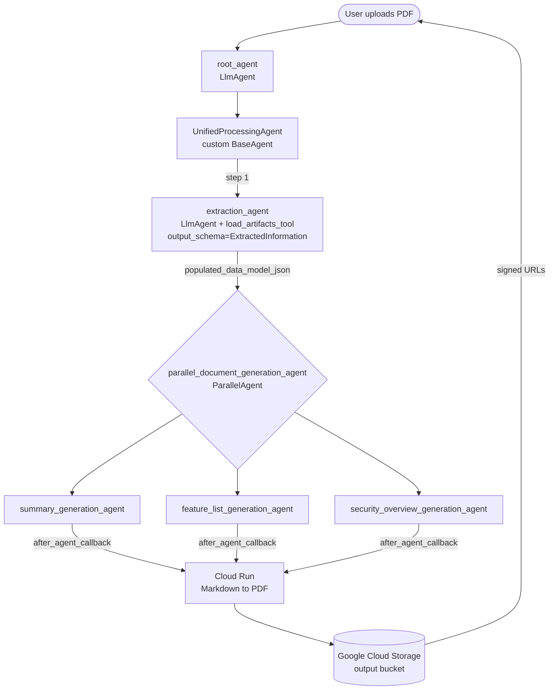

# Intelligent Document Generation Agent

This agent ingests unstructured documents (PDFs), extracts structured information using a predefined schema, generates multiple Markdown deliverables (summary, feature list, security overview) **in parallel**, converts them to PDFs via a Cloud Run microservice, and uploads the final artifacts to Google Cloud Storage with signed download URLs returned to the user.

It is a template for document-heavy enterprise workflows: RFP responses, compliance checklists, contract briefs, candidate summaries — anywhere a long input document needs to be turned into shorter, structured outputs.

## Agent Details

| Feature              | Description                                                                                                                                    |
| -------------------- | ---------------------------------------------------------------------------------------------------------------------------------------------- |
| **Interaction Type** | Workflow                                                                                                                                       |
| **Complexity**       | Intermediate                                                                                                                                   |
| **Agent Type**       | Multi Agent                                                                                                                                    |
| **Components**       | Custom `BaseAgent`, `ParallelAgent`, `LlmAgent` with `output_schema`, `load_artifacts_tool`, custom callbacks, Cloud Run tool, Cloud Storage tool |
| **Vertical**         | Horizontal / Document Processing                                                                                                               |

### Key capabilities

- **Schema-driven extraction.** A Pydantic `ExtractedInformation` model defines the fields to pull from the input document (project name, purpose, audience, features, tech, integrations, data handled, security measures). The extraction sub-agent emits JSON conforming to that schema via `output_schema`.
- **Parallel generation.** A `ParallelAgent` runs three writer sub-agents concurrently against the extracted JSON, each producing a different Markdown deliverable.
- **PDF conversion via Cloud Run.** A small FastAPI service (`deployment/endpoint/`) receives a GCS URI for a Markdown file and writes back a PDF. Callbacks invoke this service after each writer sub-agent completes.
- **Signed URLs.** Final outputs are uploaded to GCS, then signed URLs are returned in the chat surface.

## Architecture



## Prerequisites

1. A Google Cloud project with the Vertex AI APIs enabled.
2. Two Cloud Storage buckets: one for **outputs** (generated PDFs), one for **Agent Engine staging**.
3. A service account with permissions for Vertex AI, Cloud Storage, and invoking your Cloud Run conversion service.
4. The Cloud Run conversion service deployed (see [Deploy the conversion endpoint](#deploy-the-conversion-endpoint) below).
5. [`uv`](https://docs.astral.sh/uv/getting-started/installation/) for Python dependency management.

## Setup

From this agent's directory:

```bash
uv sync
cp .env.example .env
```

Then edit `.env` and fill in your Google Cloud project, bucket names, service account email, worker model, and the deployed `CONVERSION_SERVICE_URL`. `REASONING_ENGINE` is only needed after your first Agent Engine deployment — leave the placeholder until then.

## Running locally

Launch the ADK dev UI from this directory:

```bash
uv run adk web .
```

This serves a chat UI at <http://localhost:8000>. Select `intelligent_document_generation_agent` in the dropdown, then upload a PDF (sample inputs are in [`sample_inputs/`](sample_inputs)) to exercise the full extraction → parallel generation → conversion flow.

## Expected input documents

For best results, upload project proposals, technical design documents (TDDs), security briefs, or architecture overviews. The extraction schema covers:

- **Project basics:** name, purpose, target audience
- **Technical details:** features, technologies used, external integrations
- **Security and data:** data types handled, security / privacy measures

If a document doesn't contain every field, the agent works with what it can extract.

## Deploy the conversion endpoint

The agent depends on a small Cloud Run service to convert Markdown to PDF.

```bash
cd deployment/endpoint
./deploy.sh        # macOS / Linux
# or
./deploy.bat       # Windows
```

The script prompts for service name and region (or use the defaults). Copy the resulting Cloud Run URL into `CONVERSION_SERVICE_URL` in your `.env`.

To smoke-test the deployed endpoint directly:

```bash
BASE_URL=https://<your-service>.a.run.app \
GCS_URI=gs://<your-bucket>/<path>/<file>.md \
    ./deployment/endpoint/test_endpoint.sh
```

## Deploy the agent to Agent Engine

[`deployment/deploy.py`](deployment/deploy.py) wraps the Vertex AI Agent Engine API for one-shot deploy / test / delete cycles.

```bash
# Deploy
uv run python deployment/deploy.py --deploy

# Deploy with a custom display name
uv run python deployment/deploy.py --deploy --display_name "Document Generation Agent"

# Deploy and immediately send a smoke-test query
uv run python deployment/deploy.py --deploy --test

# Test an already-deployed agent
uv run python deployment/deploy.py --test --resource_id projects/<project>/locations/<location>/reasoningEngines/<id>

# Delete a deployed agent
uv run python deployment/deploy.py --delete --resource_id projects/<project>/locations/<location>/reasoningEngines/<id>
```

The script uploads `intelligent_document_generation_agent/` and pins runtime deps to `intelligent_document_generation_agent/requirements.txt`, so update that file (not `pyproject.toml`) if you need to add a package to the deployed agent. `pyproject.toml` controls local dev dependencies only.

## Project layout

```
intelligent-document-generation-agent/
├── intelligent_document_generation_agent/
│   ├── agent.py                  # Root LlmAgent + ADK App wrapper
│   ├── subagents.py              # Extraction, summary, feature-list, security sub-agents
│   ├── callbacks.py              # Before/after callbacks for sub-agents
│   ├── tools.py                  # GCS upload + Markdown-to-PDF conversion tool
│   ├── resources/                # Pydantic data models (extraction schema, structured outputs)
│   ├── utils/                    # Config (pydantic-settings), GCS helpers, logging
│   └── requirements.txt          # Runtime deps uploaded to Agent Engine
├── deployment/
│   ├── deploy.py                 # Vertex AI Agent Engine deploy / test / delete CLI
│   └── endpoint/                 # Cloud Run service: Markdown to PDF
│       ├── Dockerfile
│       ├── main.py
│       ├── deploy.sh
│       └── test_endpoint.sh
├── sample_inputs/                # Example PDFs for local testing
├── tests/                        # Unit and integration tests
├── .env.example                  # Template for .env
└── pyproject.toml                # Local dev dependencies (uv)
```

## Optional: enhance with `agent-starter-pack`

This sample stays minimal: ADK agent, a Python deploy script, and the conversion endpoint. If you want a full production scaffold — Terraform infrastructure, Cloud Build CI/CD pipelines, OpenTelemetry tracing, prompt/response logging to BigQuery, a Makefile-driven workflow, and a richer `AgentEngineApp` wrapper — you can layer it on with the [Google Cloud `agent-starter-pack`](https://github.com/GoogleCloudPlatform/agent-starter-pack):

```bash
uvx agent-starter-pack enhance .
```

> Enhancing adds files (`Makefile`, `deployment/`, `.cloudbuild/`, `app/app_utils/`, `app/agent_engine_app.py`, `GEMINI.md`) and may modify `pyproject.toml` and `README.md`. Commit any in-progress work first.

## Disclaimer

This sample is for demonstration purposes only and is not intended for production use without additional hardening.
