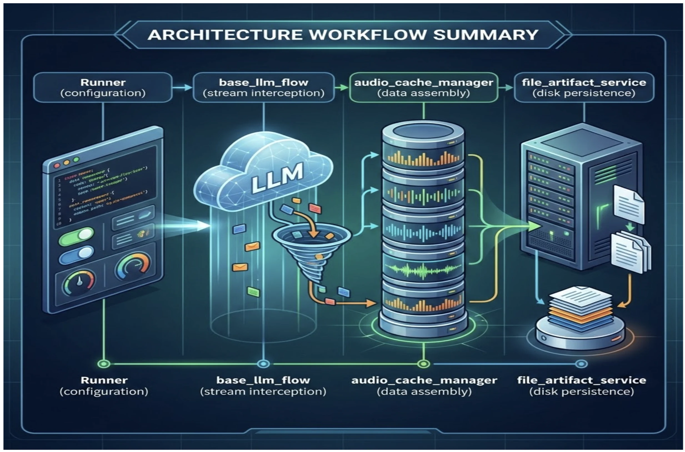

# Gemini Live: Speech-to-Text and Text-to-Speech Evaluations and Recording Audio Sessions for Audits

A Real-Time Speech-to-Text (STT) and Text-to-Speech (TTS) Evaluations and Recording framework utilizing **Google's Agent Development Kit (ADK)**, **Gemini Live**, and **FastAPI**. It is designed to capture, archive, and audit bidirectional voice interactions, featuring robust word-level Word Error Rate (WER) metric to quantify Automatic Speech Recognition (ASR) performance against pristine Ground Truth reference files, programmatically auditing voice output using a state-of-the-art Language Audio Model-as-a-Judge evaluation framework and finally using ADK's built-in file artifact service to store the session data.

## Features

- **Gemini Live Integration**: Connects dynamically to the `gemini-live-2.5-flash-native-audio` model to build enterprise voice-native conversational systems.
- **Pillar 1: Automatic Post-Session Auditing Artifacts**: By enabling the `save_live_blob=True` parameter in your `RunConfig`, the ADK triggers an internal background flow that captures, archives, and audits bidirectional live audio interactions:
  - **The "Recorder" Logic (`google/adk/flows/llm_flows/base_llm_flow.py`)**: The session engine that intercepts ongoing audio fragments and redirecting them during active session workflows.
  - **The "Buffer" Management (`google/adk/flows/llm_flows/audio_cache_manager.py`)**: Sequential volatile memory storage that appends raw chunks into memory before concatenating and transmitting them to the artifact service.
  - **The "Filing Cabinet" (`google/adk/artifacts/file_artifact_service.py`)**: Executes physical disk operations to synchronously write and structure raw `.l16` and `.pcm` audio blobs alongside `metadata.json` footprint files.
  - **The architecture diagram below illustrates the end-to-end audio capture and artifact storage workflow:** 

- **Pillar 2: ASR & STT Evaluation Engine**: Integrates a robust word-level Word Error Rate (WER) evaluation suite built using the Levenshtein distance algorithm to quantify Automatic Speech Recognition (ASR) performance and word error rates against established Ground Truth lines.
- **Language & Accent Best Practices**: Natively enforcing strict language anchoring for optimal performance on the Live API `gemini-live-2.5-flash`. By carefully aligning the API's `language_code` with the user's spoken language and explicitly embedding targeted instructions (e.g., `"RESPOND IN {OUTPUT_LANGUAGE}. YOU MUST RESPOND UNMISTAKABLY IN {OUTPUT_LANGUAGE}."`) into your system prompts, the live API anchors interactions accurately and seamlessly navigates user accent constraints [Source](https://ai.google.dev/gemini-api/docs/live-api/best-practices#language-guidelines)

## Prerequisites

1. A **Google Cloud Project** with the **Vertex AI API** enabled.
2. Active authentication via Google Cloud Default Application credentials:
   ```bash
   gcloud auth application-default login
   ```

## Setup Guide

### 1. Initialize Virtual Environment and Install Dependencies
This project uses `uv` for dependency management. Create the virtual environment and install dependencies with a single command:
```bash
uv sync
source .venv/bin/activate
```

### 2. Environment Variables
Copy the provided `.env.example` file to `.env` in the agent directory (`./info_gather_agent/.env`) containing your Google Cloud project configuration:
```env
GOOGLE_GENAI_USE_VERTEXAI=TRUE
GOOGLE_CLOUD_PROJECT=your-project-id
GOOGLE_CLOUD_LOCATION=us-central1
GCS_BUCKET_NAME=your-gcs-bucket-name
```

## Running the Application

### 1. Launch the FastAPI Server
Execute the FastAPI application to bind to `127.0.0.1:8000`:
```bash
uvicorn main:app --port 8000
```

### 2. Connect via Web Browser
Open your favorite modern web browser and navigate to:
```url
http://127.0.0.1:8000/
```
Click the **Microphone** button to resume your `AudioContext` and start speaking with Alex!

> [!NOTE]
> **Testing System Accuracy:**
> To test the accuracy of your system against the Word Error Rate (WER) evaluations, speak or read the exact scripted sentences provided in [STT_ground_truth.txt](eval/STT_ground_truth.txt) during your conversation test. Alternatively, you can update the script to validate custom dialogue workflows seamlessly.

### 3. Session Recording & Auditing Outputs

As you converse with the live agent in real-time, your session audio and dialogue interactions are comprehensively archived on-the-fly into the following project directories:

- **`<session_id>.wav`**: A consolidated, session-specific `.wav` audio recording automatically compiled, resampled, and merged from all turn-by-turn dialogue frames immediately upon WebSocket connection closure.
- **`transcripts/`**: Contains line-by-line `.txt` transcriptions of the complete conversation, clearly separating user utterances (`USER:`) and model responses (`MODEL:`).
- **`artifacts/`**: Houses the raw, byte-level audio chunks and metadata payloads collected continuously by the underlying ADK `FileArtifactService`:
  - **`*.l16;rate=16000`**: Raw 16-bit PCM Linear 16kHz audio blobs streamed from your microphone.
  - **`*.pcm`**: Real-time 24kHz audio responses emitted by the Gemini Live API.
  - **`metadata.json`**: Tracking details recording exact canonical URIs, creation timestamps, and MIME-type encodings for audit compliance.

### 4. Evaluate Speech-to-Text Performance

Productionizing voice-based agentic workloads demands strict, measurable benchmarks for Automatic Speech Recognition (ASR) and Speech-to-Text (STT) Word Error Rate (WER). Because model responses and records pulling rely heavily upon the precision of captured proper nouns (such as spelled names or email addresses), quantifying this accuracy against established Ground Truth lines is vital for auditing, quality assurance, and preventing silent performance degradation in production ecosystems.

To run the Word Error Rate (WER) evaluation against the current `eval/STT_ground_truth.txt` file, execute:
```bash
python eval/stt_eval.py
```

#### 🔍 What Happens Under the Hood
When you run the STT evaluation, the engine performs the following pipeline:
1. **Transcript Discovery**: It dynamically scans the `transcripts/` directory and targets the most recently saved session transcript file (`<session_id>.txt`).
2. **Reference Alignment**: It loads the reference sentences from [eval/STT_ground_truth.txt](eval/STT_ground_truth.txt).
3. **Normalizing Text**: It normalizes both datasets by stripping all uppercase characters, punctuation (`,`, `.`, `;`, `?`, `!`, `:`), and extra whitespace, assuring a perfectly normalized baseline.
4. **Levenshtein Distance Calculation**: It applies a dynamic programming Levenshtein distance algorithm at the word level to calculate the minimum word substitutions, insertions, and deletions required to align the transcribed text with the ground truth.

#### 📋 What to Expect in the Output
The terminal will output a highly structured per-sentence comparison report followed by a final evaluation card:
* **Utterance-Level Comparison**: For each sentence, it prints the exact cleaned **Ground Truth** baseline alongside the raw **Detected** transcription.
* **Individual WER Score**: Shows the exact Word Error Rate (WER) percentage for that specific sentence.
* **Average Sentence WER**: Summarizes the overall conversational accuracy in a final metric block.
* **Mismatched Length Alert**: Triggers a warning if the number of sentences spoken during the live session differs from the ground truth script.

#### 💡 Why the Results Tell Us Exactly What Happened
* **Spelling & Accuracy Diagnostic**: Spelled out fields (like names and emails) are highly sensitive. A sentence-level WER of `0%` confirms the model accurately transcribed the phonetic spellings.
* **Instruction Tuning Flags**: If the WER on proper nouns is high (e.g., mistaking spelling patterns), the output reveals the exact transcription failure. This tells you *exactly* when to refine your system prompts (e.g., prompting the agent to instruct the user: *"Please spell your name slowly using phonetic keywords like 'A for Apple'"*).

---

### 5. Evaluate Text-to-Speech (TTS) Quality

To programmatically assess the speech output quality of the Gemini Live responses, the framework compiles raw agent PCM fragments chronologically, downsamples them to a standardized 16 kHz frequency, and passes the combined audio to Gemini. The model generates structured quality evaluation reports measuring the **Mean Opinion Score (MOS)** and providing thorough audit Rationales for any voice degradation or anomalies.

To run the Text-to-Speech (TTS) quality evaluation, execute:
```bash
python eval/tts_eval.py
```

#### 🔍 What Happens Under the Hood
When you run the TTS evaluation, the pipeline executes as follows:
1. **Directory Traversal**: It scans the `artifacts/` directory, automatically locating all subdirectories containing the keyword `output` in their name.
2. **Chronological Concatenation**: It reads all raw, turn-by-turn agent PCM audio chunks in sequence (sorted by timestamp) to reconstruct the exact chronological conversation.
3. **Downsampling & File Writing**: It downsamples the 24 kHz PCM chunks to a standard 16 kHz sampling rate and outputs a consolidated, single WAV recording to `eval/tts_combined_output.wav`.
4. **Centralized LLM-as-a-Judge Assessment**: It dispatches the combined audio file to the `gemini-2.5-pro` model, leveraging the centralized `TTS_EVAL_GENERATE_CONFIG` to enforce a highly detailed, structured JSON schema response.

#### 📋 What to Expect in the Output
You will see a comprehensive, structured **TTS Quality Evaluation Report**:
* **Mean Opinion Score (MOS)**: A numeric score from 1 (Poor/Unintelligible) to 5 (Excellent/Human-like) assessing the overall voice output.
* **Detailed Rationale**: An objective breakdown analyzing voice clarity, pacing, robotic artifacts, distortions, naturalness, and accent consistency.
* **Spot-Auditing Capture**: If the score is 3 or below, the report provides the exact phrase and timestamp where the audio suffered from robotic transitions or unexpected accent shifts.

#### 💡 Why the Results Tell Us Exactly What Happened
* **Automated QA Audit**: Instead of forcing human reviewers to manually listen to hours of call logs, the LLM-as-a-Judge acts as an automated auditor to immediately flag performance regressions.
* **Voice Persona Validation**: The report tells you *exactly* if the agent's prebuilt voice (e.g., Achird, Puck, etc.) maintains premium quality throughout the conversation. If the score drops, the rationale highlights the specific phonetic transitions where the pacing or accent drifted, allowing developers to optimize WebSocket frame rates or adjust `RunConfig` parameters.

## Project Directory Layout

- **`main.py`**: Primary FastAPI application hosting HTTP endpoints and WebSocket streaming logic.
- **`info_gather_agent/agent.py`**: Configures the ADK Agent persona, model options, and conversational instruction sets.
- **`utils/frontend/index.html`**: Premium user interface featuring glassmorphic design and real-time JavaScript Web Audio API scheduling queues.
- **`utils/audio_utils.py`**: Consolidates saved `.pcm` and `.l16` audio blobs into merged `.wav` files.
- **`eval/stt_eval.py`**: Word Error Rate (WER) word-level comparison and ASR accuracy scoring.
- **`eval/tts_eval.py`**: Synthesizes agent PCM blobs and runs structured MOS speech quality assessments via Gemini.
- **`utils/prompt.py`**: Centralized prompt library housing system instructions for the welcoming agent and the TTS MOS quality evaluator.
- **`utils/config.py`**: Centralized configuration file housing model names, session variables, and real-time streaming `RunConfig` parameters for both the conversational assistant and the evaluation frameworks.
