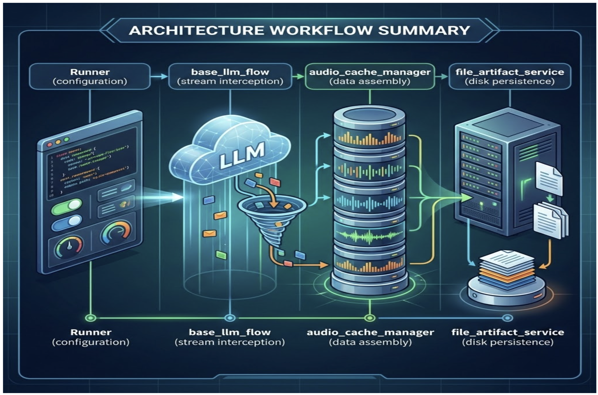

# Gemini Live: Speech-to-Text Evaluation and Recording Audio Sessions for Audits

A Real-Time Speech-to-Text (STT) Evaluation and Recording framework utilizing **Google's Agent Development Kit (ADK)**, **Gemini Live**, and **FastAPI**. It is designed to capture, archive, and audit bidirectional voice interactions, featuring robust word-level Word Error Rate (WER) evaluations to quantify Automatic Speech Recognition (ASR) performance against pristine Ground Truth reference files.

## Features

- **Gemini Live Integration**: Connects dynamically to the `gemini-live-2.5-flash-native-audio` model to build enterprise voice-native conversational systems.
- **Pillar 1: Automatic Post-Session Auditing Artifacts**: By enabling the `save_live_blob=True` parameter in your `RunConfig`, the ADK triggers an internal background flow that captures, archives, and audits bidirectional live audio interactions:
  - **The "Recorder" Logic (`google/adk/flows/llm_flows/base_llm_flow.py`)**: The session engine that intercepts ongoing audio fragments and redirecting them during active session workflows.
  - **The "Buffer" Management (`google/adk/flows/llm_flows/audio_cache_manager.py`)**: Sequential volatile memory storage that appends raw chunks into memory before concatenating and transmitting them to the artifact service.
  - **The "Filing Cabinet" (`google/adk/artifacts/file_artifact_service.py`)**: Executes physical disk operations to synchronously write and structure raw `.l16` and `.pcm` audio blobs alongside `metadata.json` footprint files.
  - **The architecture diagram below illustrates the end-to-end audio capture and artifact storage workflow:** 

- **Pillar 2: ASR & STT Evaluation Engine**: Integrates a robust word-level Word Error Rate (WER) evaluation suite built using the Levenshtein distance algorithm to quantify Automatic Speech Recognition (ASR) performance and word error rates against established Ground Truth lines.
- **Language & Accent Best Practices**: Natively enforcing strict language anchoring for optimal performance on the Live API `gemini-live-2.5-flash`. By carefully aligning the API's `language_code` with the user's spoken language and explicitly embedding targeted instructions (e.g., `"RESPOND IN {OUTPUT_LANGUAGE}. YOU MUST RESPOND UNMISTAKABLY IN {OUTPUT_LANGUAGE}."`) into your system prompts, the live API anchors interactions accurately and seamlessly navigates user accent constraints [Source](https://ai.google.dev/gemini-api/docs/live-api/best-practices#language-guidelines)

## Prerequisites

1. A **Google Cloud Project** with the **Vertex AI API** enabled.
2. Active authentication via Google Cloud Default Application credentials:
   ```bash
   gcloud auth application-default login
   ```

## Setup Guide

### 1. Initialize Virtual Environment (Python 3.12)
Create and activate a isolated virtual environment using Python 3.12:
```bash
python3.12 -m venv .venv
source .venv/bin/activate
```

### 2. Install Project Dependencies
Ensure your environment is up to date and install all necessary dependencies listed in `requirements.txt`:
```bash
pip install --upgrade pip
pip install -r requirements.txt
```

### 3. Environment Variables
Copy the provided `.env.example` file to `.env` in the parent directory (`../.env`) containing your Google Cloud project configuration:
```env
GOOGLE_GENAI_USE_VERTEXAI=TRUE
GOOGLE_CLOUD_PROJECT=your-project-id
GOOGLE_CLOUD_LOCATION=us-central1
```

## Running the Application

### 1. Launch the FastAPI Server
Execute the FastAPI application to bind to `127.0.0.1:8000`:
```bash
python main.py
```

### 2. Connect via Web Browser
Open your favorite modern web browser and navigate to:
```url
http://127.0.0.1:8000/
```
Click the **Microphone** button to resume your `AudioContext` and start speaking with Alex!

> [!NOTE]
> **Testing System Accuracy:**
> To test the accuracy of your system against the Word Error Rate (WER) evaluations, speak or read the exact scripted sentences provided in [STT_ground_truth.txt](eval/STT_ground_truth.txt) during your conversation test. Alternatively, you can update the script to validate custom dialogue workflows seamlessly.

### 3. Session Recording & Auditing Outputs

As you converse with the live agent in real-time, your session audio and dialogue interactions are comprehensively archived on-the-fly into the following project directories:

- **`session.wav`**: A consolidated, post-session `.wav` audio recording automatically merged, converted, and resampled from all turn-by-turn dialogue frames upon FastAPI server shutdown.
- **`transcripts/`**: Contains line-by-line `.txt` transcriptions of the complete conversation, clearly separating user utterances (`USER:`) and model responses (`MODEL:`).
- **`artifacts/`**: Houses the raw, byte-level audio chunks and metadata payloads collected continuously by the underlying ADK `FileArtifactService`:
  - **`*.l16;rate=16000`**: Raw 16-bit PCM Linear 16kHz audio blobs streamed from your microphone.
  - **`*.pcm`**: Real-time 24kHz audio responses emitted by the Gemini Live API.
  - **`metadata.json`**: Tracking details recording exact canonical URIs, creation timestamps, and MIME-type encodings for audit compliance.

### 4. Evaluate Speech-to-Text Performance

Productionizing voice-based agentic workloads demands strict, measurable benchmarks for Automatic Speech Recognition (ASR) and Speech-to-Text (STT) Word Error Rate (WER). Because model responses and records pulling rely heavily upon the precision of captured proper nouns (such as spelled names or email addresses), quantifying this accuracy against established Ground Truth lines is vital for auditing, quality assurance, and preventing silent performance degradation in production ecosystems.

To run the Word Error Rate (WER) evaluation against the current `eval/STT_ground_truth.txt` file, execute:
```bash
python eval/stt_eval.py
```

## Project Directory Layout

- **`main.py`**: Primary FastAPI application hosting HTTP endpoints and WebSocket streaming logic.
- **`info_gather_agent/agent.py`**: Configures the ADK Agent persona, model options, and conversational instruction sets.
- **`utils/frontend/index.html`**: Premium user interface featuring glassmorphic design and real-time JavaScript Web Audio API scheduling queues.
- **`utils/wav_file_conversion.py`**: Consolidates saved `.pcm` and `.l16` audio blobs into merged `.wav` files.
- **`eval/stt_eval.py`**: Word Error Rate (WER) word-level comparison and ASR accuracy scoring.
